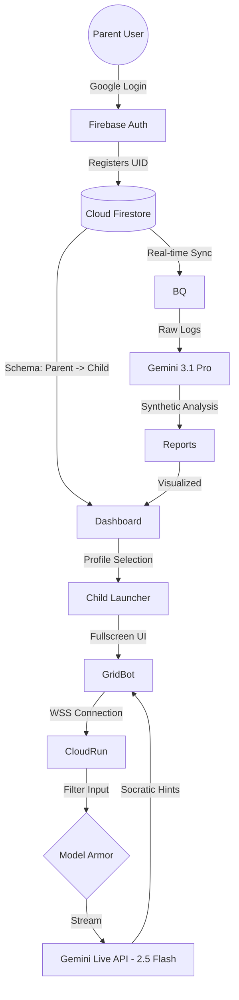

# Mindo: The Socratic AI Tutor for the Next Generation

Mindo is a next-generation AI-powered tutor designed for children aged 4 to 12. Unlike traditional educational tools that simply provide answers, Mindo acts as a Socratic companion, using real-time vision and voice to guide students through their learning process, fostering critical thinking and active reasoning.

Built for the Gemini Live Agent Challenge, Mindo leverages the cutting-edge capabilities of Google's Gemini models to create a "Live" experience where the technology disappears, and the learning begins.

## 🚀 Key Features

*   **Socratic Hinting System:** Mindo is programmed to never give direct answers. Instead, it uses analogies (for younger kids) and logical scaffolding (for older ones) to help students discover the "How" and "Why" behind every problem.
*   **Multimodal Live Interaction:** Powered by the Gemini Live API, Mindo "sees" through the camera to identify homework tasks in real-time and "hears" natural voice questions, responding with affective, age-appropriate dialogue.
*   **Interactive Living Whiteboard:** A digital canvas where children can solve math problems or draw by hand. Mindo reacts visually to every stroke, projecting animations and emojis to keep the student engaged.
*   **Expressive "Grid-Bot" Persona:** A non-humanoid, digital clock-style robot interface with pixel-matrix eyes that express emotions (smiling, surprised, thinking, calculating) in milliseconds.
*   **Intelligent Parental Insights:** Parents get automated daily, weekly, and monthly reports via BigQuery and Gemini 3.1 Pro analysis, detailing the child's emotional tone, learning pace, and specific subjects needing human attention.
*   **Safety First (COPPA Compliant):** Integrated with Google Cloud Model Armor to ensure strict content filtering, protecting minors from inappropriate topics and ensuring a secure learning environment.

## 🛠️ Technical Stack

*   **AI Brain:** Gemini Live API (gemini-2.5-flash-native-audio) for real-time interaction.
*   **Reasoning Engine:** Gemini 3.1 Pro for deep pedagogical planning and report synthesis.
*   **Frontend:** React (Vite) + Tailwind CSS + Framer Motion (vibe-coded with Antigravity).
*   **Backend & Auth:** Firebase Authentication (Google Sign-In) + Cloud Run (WebSocket proxy).
*   **Database & Analytics:** Cloud Firestore for profiles and interaction logs; BigQuery for long-term analytics.
*   **Security:** Model Armor (Project-level floor settings).

## 📂 Project Structure

```
mindo/
├── .agent/             # Antigravity agent rules and workflows
├── mindo-live-proxy/   # Node.js WebSocket proxy logic (backend)
├── mindo-webapp/       # React dashboard and Live Agent UI (frontend)
├── archivos/           # Shared documents (like Mindo_Schema.md)
└── README.md
```

## 🌟 Vision

Mindo aims to close the gap between passive screen consumption and active learning. By using Gemini's multimodal power, we've created a tutor that is as patient as it is intelligent—a true "Study Buddy" that remembers a child's progress, tastes, and difficulties to build a genuine educational bond over time.

---

# Mindo: Context & Relationship Schema / Esquema de Contexto y Relaciones

## 1. Project Identity / Identidad del Proyecto

*   **Name:** Mindo
*   **Target Audience:** Children (4-12 years old) / Niños (4-12 años).
*   **Core Concept:** A Socratic digital tutor that uses real-time vision and voice to guide learning without giving direct answers. / Un tutor digital socrático que usa visión y voz en tiempo real para guiar el aprendizaje sin dar respuestas directas.
*   **AI Persona:** "Grid-Bot", a non-humanoid robot with a digital clock-style face and pixelated expressive eyes. / "Grid-Bot", un robot no humanoide con cara de reloj digital y ojos de píxeles expresivos.

## 2. Technical Stack & Rationale / Pila Tecnológica y Justificación

| **Technology / Tecnología** | **Role / Rol** | **Rationale / Razón de uso** |
| :--- | :--- | :--- |
| **Antigravity (Vibe Coding)** | IDE & Agent Manager | Orchestrates development through natural language; manages autonomous coding agents. / Orquestra el desarrollo mediante lenguaje natural; gestiona agentes de código autónomos. |
| **Firebase Auth** | Identity Provider | Handles secure Google Sign-In for parent authorization (Adult-in-the-loop). / Gestiona el inicio de sesión seguro con Google para la autorización del padre. |
| **Cloud Firestore** | NoSQL Database | Hierarchical storage for user profiles (1 Parent -> 3 Kids) and session history. / Almacenamiento jerárquico de perfiles (1 Padre -> 3 Niños) e historial de sesiones. |
| **Cloud Run** | Compute Engine | Hosts the backend container with WebSocket support for the Live API. / Aloja el contenedor del backend con soporte de WebSockets para la Live API. |
| **Gemini Live API (2.5 Flash)** | Real-time Multimodal AI | Processes 1 FPS video and low-latency voice for the tutoring dialogue. / Procesa video a 1 FPS y voz de baja latencia para el diálogo de tutoría. |
| **Gemini 3.1 Pro** | Reasoning & Insights | Performs "Deep Thinking" for Socratic planning and report generation from logs. / Realiza "Pensamiento Profundo" para planificación socrática y generación de reportes. |
| **Model Armor** | AI Safety Layer | Mandatory filter for child safety (CSAM), jailbreak protection, and PII masking. / Filtro obligatorio para seguridad infantil, protección contra jailbreaks y enmascaramiento de datos. |
| **BigQuery** | Analytics Warehouse | Stores interaction logs exported from Firestore for long-term reporting. / Almacena logs de interacción exportados de Firestore para reportes a largo plazo. |

## 3. Relationship Graph / Gráfico de Relaciones



## 4. Component Interactions / Interacciones entre Componentes

### A. Parental Control Layer (Identity -> Data)

*   **EN:** Firebase Auth provides a Unique ID (UID) used as the key in Firestore. The system restricts creation to 3 child profiles per UID to comply with the project scope.
*   **ES:** Firebase Auth proporciona un ID único (UID) usado como clave en Firestore. El sistema restringe la creación a 3 perfiles de niños por cada UID para cumplir con el alcance.

### B. The Live Scaffolding (UI -> Cloud Run -> AI)

*   **EN:** The React frontend captures video frames and audio. Cloud Run proxies this via WebSockets to the **Gemini Live API**. **Model Armor** acts as a middleman, sanitizing every prompt to ensure COPPA compliance and safety for minors.
*   **ES:** El frontend en React captura frames de video y audio. Cloud Run actúa como proxy vía WebSockets hacia la **Gemini Live API**. **Model Armor** actúa como intermediario, saneando cada instrucción para asegurar el cumplimiento de seguridad infantil.

### C. Insight & Reporting (BigQuery -> Gemini 3.1 Pro)

*   **EN:** Firestore session data is mirrored to **BigQuery**. **Gemini 3.1 Pro** queries these logs to identify learning patterns (e.g., "The child struggled with division today") and synthesizes the final report for the parent.
*   **ES:** Los datos de sesión en Firestore se reflejan en **BigQuery**. **Gemini 3.1 Pro** consulta estos logs para identificar patrones de aprendizaje (ej. "El niño tuvo dificultades con divisiones hoy") y sintetiza el reporte final.

## 5. Metadata & Profile Structure (Antigravity Context)

For development in **Antigravity**, child profiles must follow this schema:

```json
{
  "profile_id": "uuid-v4",
  "child_name": "string",
  "age": "integer (4-12)",
  "school_level": "string",
  "ai_tutor": {
    "name": "string",
    "eye_variant": "matrix_block | matrix_round",
    "theme_color": "hex_code"
  },
  "pedagogical_state": {
    "current_subject": "math | science | language",
    "socratic_depth": "adaptive",
    "last_completed_task": "timestamp"
  }
}
```

## 6. Socratic Logic Guardrails / Reglas de Lógica Socrática

1.  **Rule 1:** Never provide the final answer. / Nunca dar la respuesta final.
2.  **Rule 2:** Provide hints based on the child's age (use analogies for 4yo, logic for 12yo). / Dar pistas basadas en la edad (analogías para 4 años, lógica para 12 años).
3.  **Rule 3:** Validation step: The task is not "done" until the child explains the solution back to the agent. / Paso de validación: La tarea no termina hasta que el niño explica la solución de vuelta al agente.
